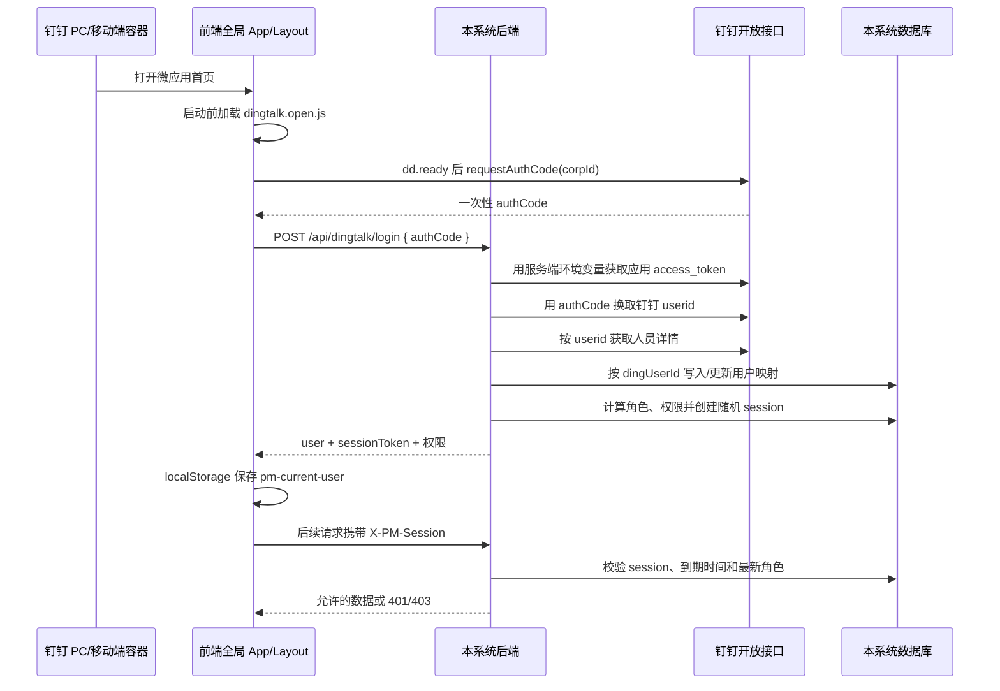

# 钉钉内免登与系统会话复盘教案

> 适用对象：钉钉企业内部 H5 微应用。
> 目标：在钉钉内打开应用后识别真实当前用户，并将钉钉身份换成本系统可鉴权的会话。
> 本文不记录 AppSecret、access token、authCode 或 sessionToken 等敏感值。

## 1. 先说结论

这次问题的根因不在后端接口、人员同步或权限表，而在 **钉钉 PC 容器与前端 JSAPI 的桥接方式**：

- 页面运行在钉钉 PC 内，但初始页面没有得到可用的原生桥；
- 后续动态插入的 SDK 虽然创建了 `dd` 对象，却没有正确建立当前 PC 容器所需的授权回调通道；
- 因此 `requestAuthCode` 被调用后，既没有成功回调，也没有失败回调，只能等到前端自己的 12 秒超时；
- 最终改为：在 SPA 启动前静态加载钉钉 H5 微应用标准 JSAPI `dingtalk.open.js`，并保留单次、可诊断的免登调用。授权码开始正常返回，后端才得以创建本系统会话。

关键认识：**`dd` 存在，不等于免登桥已经可用。** 必须观察 `dd.ready`、授权码成功/失败回调以及后端是否收到登录请求，才能定位在哪一层断了。

---

## 2. 最终实现的完整技术路径



### 2.1 前端只做两件事

1. 从钉钉容器取得一次性 `authCode`；
2. 将 `authCode` 立即交给本系统后端，保存后端返回的 `sessionToken`。

前端 **不应** 保存或使用 AppSecret、access token，也不能以姓名、角色、人员 ID 或 localStorage 作为写权限依据。

### 2.2 后端才是可信身份边界

后端通过环境变量取得钉钉应用凭证，完成：

1. 取得应用 access token；
2. 用 `authCode` 换取稳定的钉钉 `userid`；
3. 查询人员详情；
4. 以钉钉 `userid` 为唯一键建立本系统人员/用户映射；
5. 重新计算该人的角色与权限；
6. 生成高随机度、可过期、服务端可撤销的 session；
7. 后续写操作只认证 `X-PM-Session`。

---

## 3. 本项目中的代码落点

| 分层 | 文件 | 职责 |
| --- | --- | --- |
| 页面启动与免登 | [frontend/index.html](../frontend/index.html) | 在 Vue 挂载前加载标准钉钉 H5 JSAPI。 |
| 全局免登状态 | [frontend/src/App.vue](../frontend/src/App.vue) | 只挂载一次；等待 `dd.ready`；请求 authCode；浏览器优雅降级；更新顶部身份状态。 |
| 统一请求头 | [frontend/src/lib/api.ts](../frontend/src/lib/api.ts) | 保存 sessionToken，并为 API 请求自动附带 `X-PM-Session`。 |
| 钉钉接口与登录 | [backend/app/api/v1/dingtalk.py](../backend/app/api/v1/dingtalk.py) | `/api/dingtalk/config`、`/api/dingtalk/login`、人员映射和会话创建。 |
| 钉钉服务调用 | [backend/app/services/dingtalk.py](../backend/app/services/dingtalk.py) | 使用服务端环境变量调用钉钉开放接口。 |
| 会话与鉴权 | [backend/app/core/auth.py](../backend/app/core/auth.py) | 随机 token、散列保存、过期校验、`operator_from_request`。 |
| 用户/会话数据模型 | [backend/app/models/domain.py](../backend/app/models/domain.py) | `UserSession`、钉钉人员和部门映射。 |

### 公开与私密配置的边界

`GET /api/dingtalk/config` 只返回前端启动所需的非敏感信息，例如 corpId、agentId、是否已配置。

以下内容只允许出现在服务器环境变量中：

- 应用 Client ID/AppKey；
- 应用 Client Secret/AppSecret；
- 钉钉 access token；
- 本系统的原始 sessionToken。

日志中同样不记录以上原始值。诊断日志只记录阶段、桥名称、精简错误和 User-Agent。

---

## 4. 这次的迭代记录：现象、判断与处理

| 轮次 | 现象 | 当时判断 | 处理 | 结论 |
| --- | --- | --- | --- | --- |
| 1 | 钉钉内顶部一直“正在识别”或“识别失败”。 | 先确认是不是应用凭证、corpId 或后端接口没有配置。 | 增加非敏感配置接口与后端登录链路。 | 配置接口正常，问题没有进入后端换人阶段。 |
| 2 | PC 容器中没有可直接使用的 `window.dd`。 | 可能是客户端没有原生注入。 | 检查并尝试兼容 `DingTalkPC`。 | 老 PC 桥可见，但授权码回调仍不稳定。 |
| 3 | `DingTalkPC.runtime.permission.requestAuthCode` 调用后超时。 | 可能是回调式与 Promise 式 JSAPI 差异。 | 同时兼容回调和 Promise 返回值。 | 并未解决：既未成功也未失败，说明不是返回值处理问题。 |
| 4 | 加载另一份动态 SDK 后有 `dd`，但仍“获取授权码超时”。 | 不能只看 `dd` 是否存在，需确认 SDK 与当前容器握手是否正确。 | 在服务端加入安全诊断：SDK 加载、桥发现、`ready`、调用、回调/超时。 | 日志证明请求确实发起，但 12 秒内没有任何钉钉回调。 |
| 5 | 为避免未登录访问业务数据，曾用身份状态控制整个 `RouterView`。 | 认为可以阻止未授权页面。 | 该改动导致认证失败时路由内容被整体卸载。 | 这是一次回归：前端“体验守卫”不能替代后端鉴权，已立即恢复无条件 RouterView。 |
| 6 | 钉钉 PC 日志持续显示：SDK 已加载、`requestAuthCode` 已调用、随后超时。 | 根因收敛为动态加载 SDK 的桥接不匹配。 | 改用钉钉 H5 微应用标准 `dingtalk.open.js`，并放入 `index.html`、在 Vue 启动前加载。 | 修复成功：授权码回调恢复，后端可创建系统 session。 |

### 4.1 完整逐轮记录（包含无效尝试与回归）

这一节保留“做过什么”和“为什么没有成功”，不把失败步骤改写成事后看来很合理的过程。

| 序号 | 实际改动/验证 | 看到的结果 | 这一步为什么没有解决 | 后续正确动作 |
| --- | --- | --- | --- | --- |
| 01 | 先补齐后端 `config`、`login`、用户映射和系统 session 的链路。 | 配置接口可访问，服务器环境变量已生效；但页面仍无法识别人。 | 前端没有拿到 authCode，后端完整并不意味着前端桥接已通。 | 将排查点前移到钉钉 JSAPI。 |
| 02 | 前端先检查 `window.dd`，没有时把它当作“钉钉桥未注入”。 | 钉钉 PC 内仍显示识别失败。 | 某些 PC 客户端不会在初始时机直接暴露可用 `dd`。 | 增加对旧 `DingTalkPC` 桥的兼容探测。 |
| 03 | 使用发现到的 `DingTalkPC.runtime.permission.requestAuthCode` 请求 authCode。 | 12 秒后“获取授权码超时”。 | 函数能调用不代表客户端授权回调已被连接。 | 不再仅凭对象存在判断成功；记录回调阶段。 |
| 04 | 运行中动态加载一份 SDK，期望得到新的 `dd` 桥。 | 日志显示 SDK 已加载、`dd` 已存在，但仍超时。 | 载入的是另一套 SDK，且加载时机已晚于 SPA/容器初始化；得到的是“表面可用”的桥。 | 对照钉钉 H5 微应用标准脚本与加载时机。 |
| 05 | 兼容 callback 与 Promise 两种返回方式。 | 仍超时，既没有 callback，也没有 Promise resolve/reject。 | 问题不是“收到返回值后不会解析”，而是钉钉根本没有发回结果。 | 增加精确诊断：`ready`、调用、成功、失败分别记录。 |
| 06 | 将客户端诊断发送到服务器，记录 SDK 加载、桥类型、调用与超时，且不记录 authCode。 | 日志证明：配置读取成功 → SDK 加载成功 → 调用发起 → 12 秒无任何回调。 | 这是诊断步骤，本身不改变桥接。 | 根因由“猜后端配置”收敛为“PC JSAPI 桥接与 SDK 时机”。 |
| 07 | 为了防止未登录用户访问，在前端用 `currentUser` 控制整个 `RouterView`。 | 免登失败时所有路由像失效一样空白或不能切换。 | 这是错误的边界：前端身份状态被误当成路由挂载条件。 | 立即恢复无条件 `RouterView`；写权限仍由后端 session 控制。 |
| 08 | 单独验证路由恢复：点击资产库、我的使用等页面，确认 URL 与内容都随路由变化。 | 路由恢复，不再因免登失败卸载页面。 | 此步骤只修复了第 07 步引入的回归，并未修复免登。 | 保持业务页面冻结，不再触碰路由。 |
| 09 | 使用钉钉 H5 微应用标准 `dingtalk.open.js` 替换之前动态加载的包。 | 需要再次在真实钉钉 PC 容器验证。 | 只替换 URL 仍可能因脚本晚加载而失败。 | 将该脚本放入 `index.html`。 |
| 10 | 将标准 JSAPI 静态放在 SPA 模块入口之前加载；运行时逻辑只作探测与兜底，不再重复插入第二份桥。 | 钉钉授权码回调恢复，后端登录接口得以被调用。 | — | 免登修复完成。 |

### 4.2 为什么会反复修复：真实原因与应吸取的教训

这不是因为后端一直有新错误，而是前期排查顺序不够严格，出现了三个工程失误：

1. **没有先建立完整证据链。**
   最初看到“身份失败”时，原因可能在钉钉应用配置、客户端 SDK、前端调用、后端换码、用户映射或权限。前几轮先做了兼容和替代调用，再补诊断，导致每一次都只能排除一小段可能性。正确顺序应是先记录“配置是否返回、SDK 是否加载、`ready` 是否触发、授权码是否回调、后端是否收到登录”。

2. **把“有 `dd` 对象”误判为“桥已可用”。**
   动态脚本确实让页面有了 `dd` 和 `requestAuthCode`，却不代表它已同当前钉钉 PC 容器建立授权回调。这个误判导致先后尝试旧桥、动态 SDK 和 Promise 兼容；它们并不危险，但没有击中根因。

3. **一次前端保护措施越过了修改边界。**
   用 `v-if` 卸载 `RouterView` 是为了避免未认证页面访问数据，但它错误影响了路由主体。这直接违反了“免登改动不得影响既有模块”的要求。问题发现后已回退；后续明确采用后端 401/403 做真正保护，前端只展示友好状态。

如果一开始采用第 06 步的诊断链，再直接使用第 10 步的标准加载方式，前面大部分尝试都不需要发生。这正是这次复盘最有价值的地方。

### 4.1 最重要的排查证据链

遇到“获取授权码超时”时，不要直接改后端。按下列顺序判断：

1. 前端是否成功请求 `/api/dingtalk/config`？
2. 当前访问是否确实来自钉钉客户端，而非普通浏览器？
3. 标准 JSAPI 是否在 SPA 启动前已经加载？
4. `dd.ready` 是否执行？
5. `requestAuthCode` 的 `onSuccess`、`onFail` 或 Promise 是否有任何一个触发？
6. 后端是否收到 `/api/dingtalk/login`？
7. 后端收到 authCode 后，才检查 token 换取、userid、人员详情、数据库映射和 session。

本次证据停在第 5 步：后端从未收到登录请求，因此修复方向必须在客户端 JSAPI，而不是 access token 或用户表。

---

## 5. 为什么“超时”不等于“权限不够”

常见问题和现象不同：

| 现象 | 更可能的位置 | 优先检查 |
| --- | --- | --- |
| 直接报没有 `dd` / JSAPI 未注入 | 前端运行环境或 SDK | 是否在钉钉内、SDK 地址、PC 首页与 JSAPI 域名。 |
| `dd.ready` 不执行 | SDK/桥初始化 | SDK 是否过晚动态插入、是否使用标准 H5 SDK。 |
| 调用后 `onFail` 返回明确错误码 | 钉钉应用配置 | 应用发布状态、PC/移动首页、JSAPI 安全域名、可见范围。 |
| 调用后一直没有任何回调 | JSAPI 桥接 | SDK 加载时机、SDK 包兼容性、钉钉客户端版本。 |
| 后端收到登录请求但返回失败 | 后端钉钉调用 | 服务器环境变量、应用凭证、authCode 时效、接口权限。 |
| 登录成功但页面仍不能写入 | 系统权限 | `X-PM-Session`、session 是否过期、用户角色和资源范围。 |

权限不足通常会有钉钉错误回调或后端 API 错误；本次是“调用没有回调”，两者不应混为一谈。

---

## 6. 可复用的新项目实施步骤

### A. 钉钉开发者平台准备

1. 创建并发布企业内部 H5 应用；
2. 配置 PC 端和移动端首页地址，均使用 HTTPS；
3. 配置 JSAPI 安全域名为应用实际域名；
4. 按业务开通通讯录/成员详情所需权限；
5. 确保测试人员位于应用可见范围内；
6. 记录 corpId、agentId、Client ID，但把 Client Secret 仅配置在服务器环境变量。

### B. 前端最小实现

```ts
// index.html：必须早于 SPA 入口加载
// https://g.alicdn.com/dingding/dingtalk-jsapi/2.10.3/dingtalk.open.js

dd.ready(() => {
  dd.runtime.permission.requestAuthCode({
    corpId,
    onSuccess: ({ code }) => loginOnServer(code),
    onFail: (error) => showReadableFallback(error),
  });
});
```

前端要求：

- 只在全局 Layout/App 执行一次；
- authCode 只传给后端，不做持久化；
- 会话 token 由后端返回后再保存；
- 普通浏览器显示“浏览器访问”，可看只读页，但默认无写权限；
- 不要让免登失败卸载整个路由树或导致白屏。

### C. 后端最小实现

```text
POST /api/dingtalk/login
  接收 authCode
  → 用服务端凭证获取应用 access token
  → authCode 换 userid
  → userid 查人员详情
  → upsert 本系统用户映射
  → 重算角色/权限
  → 创建随机、可过期的 session
  → 返回 user + sessionToken
```

后端要求：

- `dingUserId` 是主身份键，姓名只用于展示和历史兼容；
- session 原始 token 只发给客户端一次，数据库保存其散列值；
- 所有写接口统一从 `X-PM-Session` 获取当前用户；
- 无 session 返回 401，权限不足返回 403；
- 每次请求可重新读取角色/权限，使权限变更及时生效。

### D. 测试与上线顺序

1. 在普通浏览器测试：页面可打开、没有未捕获异常、写操作为 401/403；
2. 在钉钉 PC 测试：用户名显示真实当前人；
3. 在钉钉移动端测试同一流程；
4. 刷新页面：会话仍可恢复；
5. 清理 session 或等待过期：可自动再次免登；
6. 用伪造姓名、角色、旧 `X-User-Id` 请求写接口：必须失败；
7. 用管理员、编辑者、查看者分别验证可见和可写范围；
8. 部署前备份静态站点、后端文件与数据库；部署后验证入口页引用的是新哈希包。

---

## 7. 这次最值得保留的工程原则

### 原则 1：身份失败不能影响基本导航

路由决定“显示哪个页面”，后端鉴权决定“能否读写数据”。

正确做法是：认证失败时页面显示身份提示、只读内容或空状态；写操作由服务器拒绝。不要将 `<RouterView>` 包在 `v-if="currentUser"` 中，否则一次免登异常就会让所有页面像“路由失效”一样消失。

### 原则 2：先建立可观察性，再继续猜

客户端诊断至少记录这些阶段：

```text
sdk_load_start
sdk_bridge_ready
bridge_ready_callback
request_auth_code_invoke
request_auth_code_success / request_auth_code_failed
server_login_success / server_login_failed
```

每个阶段只记录安全的状态信息，绝不记录 authCode、secret、access token、完整 sessionToken。

### 原则 3：SDK 要在正确时间加载

第三方容器 JSAPI 并不是普通 npm 工具库。它通常需要在页面启动阶段与容器建立桥接；“等 Vue 已运行再动态插入脚本”在某些 PC 客户端中会出现对象存在但回调缺失的假可用状态。

### 原则 4：前端状态只是体验，服务端 session 才是权限

`pm-current-user` 用于刷新页面后恢复头像、姓名和菜单体验；它不是权限证明。真正权限始终来自服务端保存的 session 以及服务端重新计算的角色。

---

## 8. 上线后的维护清单

- 每次修改免登前，备份静态文件和服务端文件；不要为免登修改或清空业务数据；
- 新增钉钉能力时，先确认是否需要 `dd.config`。单纯 `requestAuthCode` 不要为了“看起来完整”额外引入签名复杂度；
- 钉钉客户端升级后，如出现只在 PC 或只在移动端的异常，优先检查 SDK 加载与容器桥，而不是盲目替换后端；
- 用户离职、调岗或角色调整后，验证其旧 session 的可见范围是否随服务端角色重算生效；
- 将 app.env 作为服务器受控文件维护，永远不要提交真实凭证至 Git、Excel、截图或前端构建产物；
- 保留无敏感信息的诊断日志和一次成功/失败登录的时间线，后续排错速度会大幅提升。

---

## 9. 一句话记忆版

**钉钉给一次 authCode；后端换真实 userid；系统自己发随机 session；所有写入只信 session；免登失败也不能拆掉路由。**
