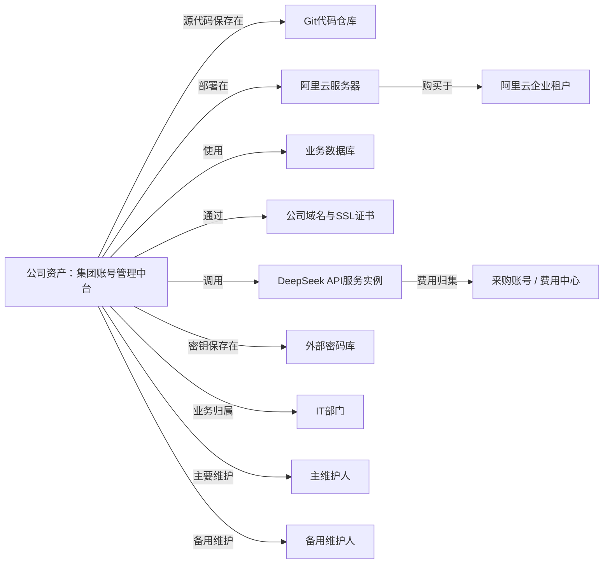
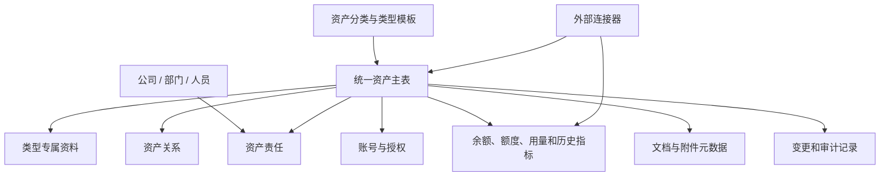

# 集团账号管理中台（账号与数字资产统一底库）

> 项目开发需求文档 V2.0
> 文档状态：开发基线 / 已确认方向
> 编制日期：2026-08-04
> 适用对象：甲方负责人、产品、UI、前端、后端、测试、部署运维人员

---

## 0. 文档说明

### 0.1 文档目的

本文档把已经确认的产品方向、后端数据模型、前端信息架构、UI主题、管理能力、可视化组件、外部接口预留和三阶段开发路线整合为一套开发基线。

开发团队应以本文档为共同依据。后续任何涉及页面、字段、关系、权限、流程、接口或部署方式的变化，都应先更新本文档，再修改代码和数据库迁移，避免只改前端表现而造成数据模型不一致。

### 0.2 产品名称与实际定位

- 对外/项目名称暂定：**集团账号管理中台**。
- 实际产品定位：**以账号为重要入口的公司账号与数字资产统一管理底库**。
- 系统不只管理账号，还要管理公司拥有或使用的平台、自研系统、SaaS、API服务、云资源、硬件、域名、证书、代码仓库、数据库和其他数字资产，以及它们之间的关系。

### 0.3 已确认的核心决策

1. 采用一个统一底库，不为平台、部门、人员分别维护三套数据。
2. 平台、部门、人员、资产类型是四种查看维度，不是四套业务系统。
3. 第一阶段先把系统骨架和真实CRUD做出来，用于登记、保存、查询、汇报和逐部门盘点。
4. 第二阶段增加申请、审批、交接、风险、复核和提醒等治理流程。
5. 第三阶段接入外部平台API，自动同步账号、余额、用量、账单或资源状态。
6. 系统不保存平台密码、API Secret、私钥和恢复码明文，只保存外部密码库引用或密钥系统引用。
7. 第一版交付三套可切换UI主题：Bitwarden式、Hudu式深色资产库、Ant Design Pro式。
8. 所有业务页面、接口和权限逻辑保持唯一，主题切换不得复制三套业务代码。
9. 各模块可按需展开数据看板，并在列表和图表之间切换；图表不是强制首屏内容。
10. 管理员控制台与日常业务区分离，位于左侧导航底部产品切换区。

### 0.4 开发原则

- 先把未知资产装得进来，再逐步把高频类型标准化。
- 先解决“公司有什么、在哪里、谁负责、如何接管”，再做自动化。
- 人员可以负责资产，但公司资产的所有权主体必须是公司法人/经营主体。
- 相同数据只维护一次，所有视图和图表都从同一底库计算。
- 常见类型使用标准字段；暂时未知的类型允许配置扩展字段。
- 核心业务状态必须通过后端服务层改变，并同时记录审计信息。
- 第一阶段控制复杂度，遵守2核2G共享服务器的长期运行约束。

---

## 1. 项目背景与建设目标

### 1.1 业务背景

公司规模较小，但具备人事、财务、法务、IT、营销、运营、供应链、售后等完整部门。各部门持续注册和采购电商平台、云服务、SaaS、社交媒体、软件工具、API服务、设备和其他业务资源，目前缺少统一台账与责任机制。

同时，公司内部会自行开发管理系统、自动化脚本、AI工作流、智能体和其他软件。如果代码、部署方式、服务器、数据库、管理员账号和维护责任只掌握在个人手中，人员离职后可能出现系统无法接管、资产流失或重复开发。

### 1.2 当前问题

- 平台、账号和资源散落在个人记忆、聊天记录、浏览器、表格和不同密码工具中。
- 领导无法快速了解公司拥有哪些数字资产、哪些即将到期、哪些存在单人依赖。
- 同一个平台可能被多个部门使用，也可能同时承担供应商、购买渠道、部署环境和费用结算渠道等角色。
- 账号所有人、使用人、管理员、费用负责人、MFA保管人经常混在一起。
- 自研系统缺少公司化接管资料，代码、服务器、数据库、密钥、备份和文档不完整。
- SaaS、API和按量服务的余额、额度、调用量需要人工登录各个平台查看。
- 员工离职或调岗时，账号、授权、系统、设备和维护责任容易遗漏。

### 1.3 建设目标

1. 建立公司统一的账号与数字资产底库。
2. 用平台、部门、人员和资产类型四种视角查看同一套数据。
3. 明确每项资产的公司所有权、归属部门、业务负责人、技术负责人和备用负责人。
4. 建立资产之间“部署在、使用、依赖、购买自、存储于、维护”等关联关系。
5. 让公司自研系统具备可接管资料，避免关键系统依赖单个员工。
6. 对SaaS、API和按量服务记录套餐、费用、余额、额度和历史用量。
7. 第二阶段形成申请、审批、交接、复核、风险和提醒闭环。
8. 第三阶段通过连接器接入重点平台，实现自动同步。
9. 在小公司可承受的成本和维护难度下长期稳定运行。

### 1.4 成功标准

| 目标 | 可验证标准 |
|---|---|
| 资产可见 | 已盘点的资产均可登记，且可以按平台、部门、人员和类型查询 |
| 责任明确 | 关键资产有主负责人，高风险资产有备用负责人 |
| 系统可接管 | 自研系统可以找到代码、部署环境、数据库、密钥引用、文档和维护人 |
| 数据一致 | 同一资产从不同维度进入时显示同一份详情和关系 |
| 低门槛 | 新部门可以用快速登记或Excel导入完成第一轮盘点 |
| 安全边界 | 数据库、接口、日志和导出文件中不出现平台密码或API Secret明文 |
| 可扩展 | 新资产类型、新关系类型和新外部连接器可以增量加入，不推翻核心模型 |
| 可运行 | 在目标2核2G共享服务器上稳定运行，无持续内存增长和连接泄漏 |

---

## 2. 产品边界与三阶段路线

### 2.1 第一阶段：资产底库与可汇报成品

第一阶段目标不是一次性治理全公司，而是先交付一个可以真实使用、保存数据和用于汇报的完整骨架。

第一阶段必须交付：

- 登录、用户、角色和数据范围。
- 公司主体、部门、人员管理。
- 统一资产登记、编辑、查询、归档和恢复。
- 预设资产类型和管理员自定义类型。
- 平台、平台租户、账号、账号责任和密码库引用。
- 公司自研系统登记模板和接管完整度检查。
- SaaS/API/按量服务的人工登记、余额和额度录入。
- 资产关系建立与查看。
- 按平台、按部门、按人员、按资产类型查看。
- 全局搜索、筛选、分页、排序和导出。
- Excel导入预览、校验和正式导入。
- 工作台以及“个人 / 部门 / 公司”视角。
- 页面列表/图表切换和可折叠数据看板。
- 管理员控制台基础能力。
- 三套UI主题及切换功能。
- 基础操作审计、数据备份和部署脚本。
- 外部连接器的数据结构、接口契约和功能开关预留，但不要求真实接通。

第一阶段不强制交付：

- 任意复杂审批流设计器。
- 自动开通账号或自动撤销外部平台权限。
- 全量SaaS自动发现。
- 大量外部平台实时同步。
- 完整固定资产折旧和财务核算。
- 自研密码保险库或浏览器自动填充插件。
- Redis、Celery、Elasticsearch、微服务和分布式部署。

### 2.2 第二阶段：流程治理

在底库数据达到可用程度后启用：

- 账号申请、权限申请、资产采购申请和额度申请。
- 固定审批链和人工执行确认。
- 离职、调岗和负责人变更交接。
- 自研系统验收和可接管检查。
- 到期、续费、轮换、复核和资料缺失提醒。
- 风险规则、风险处理和审计查询。
- 站内通知，以及企业微信/钉钉等通知渠道。

### 2.3 第三阶段：自动化连接

根据公司实际盘点结果和业务价值排序，逐个启用：

- 阿里云等云平台资源同步。
- DeepSeek等API服务余额、Token、调用量和账单同步。
- SaaS席位、订阅和到期信息同步。
- 域名和证书到期状态同步。
- 企业通讯录同步。
- 外部平台账号或授权状态同步。
- 自动预警、失败重试和同步健康监控。

---

## 3. 核心产品概念

### 3.1 资产、视角和关系

系统将信息分为三个层次：

1. **资产类型**：公司拥有什么，例如平台账号、自研系统、SaaS、API、服务器、域名或设备。
2. **查看视角**：从平台、部门、人员或资产类型看同一套数据。
3. **资产关系**：资产之间如何连接，例如系统部署在服务器上、系统调用API、代码存储在仓库中。

### 3.2 公司资产关系示例



### 3.3 资产所有权与责任

- 资产所有权主体只能是公司法人或经营主体。
- 员工不是公司资产的所有人，只能是业务负责人、技术负责人、管理员、维护人、使用人或备用负责人。
- 人员离职时改变责任关系，不改变资产所有权和历史记录。
- 关键资产至少需要一名主负责人；高风险资产还需要一名备用负责人。

### 3.4 服务类别、产品、渠道和实例

API、SaaS和按量服务必须拆分为四个概念：

- 服务类别：大模型API。
- 服务产品：DeepSeek API。
- 购买渠道：DeepSeek官网、阿里云百炼或其他中转商。
- 服务实例：公司实际购买并正在使用的那一份服务。

同一产品通过不同渠道购买时，应形成不同服务实例，各自拥有账号、费用、余额、额度、使用部门和负责人。

---

## 4. 用户、角色与数据权限

### 4.1 用户角色

| 角色 | 默认数据范围 | 主要能力 | 敏感凭证 |
|---|---|---|---|
| 普通员工 | 本人 | 查看本人使用或负责的资产和账号；维护允许字段 | 不可见明文 |
| 部门负责人 | 本部门 | 查看部门资产、人员责任、完整度和后续待办 | 不可见明文 |
| 平台/资产负责人 | 负责的平台或资产 | 维护资产、账号、关系、负责人和使用状态 | 仅能打开被授权的密码库引用 |
| 公司领导 | 全公司汇总为主 | 查看公司资产、风险、费用和完整度；默认不参与日常编辑 | 不可见明文 |
| 系统管理员 | 全公司 | 用户、权限、字典、主题、导入、集成和系统配置 | 不默认获得密码明文 |
| 审计人员 | 全公司只读 | 查看元数据、历史、流程和审计记录 | 不可见明文 |

### 4.2 权限模型

每次访问必须同时校验：

1. **页面权限**：用户能否进入某个模块。
2. **操作权限**：用户能否查看、新建、修改、归档、导出或配置。
3. **数据范围**：用户能操作本人、本部门、指定平台、指定资产还是全公司数据。
4. **敏感动作权限**：打开密码库引用、批量导出、修改管理员、配置外部连接等需要单独权限。

数据范围预设：`self`、`department`、`platform`、`asset`、`company`。

### 4.3 角色与责任的区别

- 系统角色决定“能在系统里做什么”。
- 资产责任决定“业务上对什么负责”。
- 同一个人可以是系统普通用户，同时是某个平台的负责人。
- 不得通过修改系统角色来代替资产责任关系。

---

## 5. 信息架构与导航

### 5.1 总体页面结构

- 左侧：一级导航和管理员控制台入口。
- 上方：全局搜索、通知、帮助、主题快速切换、个人菜单。
- 中间/右侧：当前模块内容区。
- 资产中心可出现二级筛选栏，用于类型、部门、人员、平台和常用条件。

### 5.2 左侧一级导航

| 模块 | 阶段 | 说明 |
|---|---:|---|
| 工作台 | 1 | 我的、部门、公司三个视角；待关注事项和关键汇总 |
| 资产中心 | 1 | 公司全部账号与数字资产的统一入口 |
| 组织与人员 | 1 | 公司主体、部门、人员及责任关系 |
| 服务与用量 | 1/3 | 第一阶段人工记录；第三阶段自动同步余额和用量 |
| 申请与交接 | 2 | 申请、审批、执行、离职和调岗交接 |
| 风险与审计 | 2 | 风险发现、处理、复核和审计查询 |
| 管理员控制台 | 1 | 左侧底部独立入口，仅管理员可见 |

### 5.3 资产中心二级入口

- 全部资产
- 平台与账号
- 公司自研系统
- 软件与SaaS
- API与按量服务
- 云资源与网络
- 数据与存储
- 域名、证书与知识产权
- 硬件与软件许可
- 资产关系视图

### 5.4 四种查看维度

资产中心统一提供：

`按平台 | 按部门 | 按人员 | 按资产类型`

四种视图只改变分组、筛选和汇总方式，不复制主数据。

### 5.5 工作台视角

工作台顶部提供：

`我的 | 本部门 | 全公司`

- 我的：本人负责、维护、使用的资产和账号。
- 本部门：本部门资产、负责人分布、缺失资料和即将到期。
- 全公司：领导和管理员可见，展示总体规模、关键风险、费用和数据完整度。

---

## 6. UI主题与交互规范

### 6.1 三套第一版主题

| 主题ID | 展示名称 | 视觉特点 | 使用建议 |
|---|---|---|---|
| `bitwarden_utility` | Bitwarden式 | 蓝色主导航、白色筛选栏、紧凑列表、安全工具感 | 第一版默认主题 |
| `hudu_dark` | Hudu式深色资产库 | 深色侧栏、资产卡片更突出、关系和详情更沉浸 | IT资产管理场景 |
| `ant_pro_enterprise` | Ant Design Pro式 | 企业后台、浅色页面、标准表格和筛选布局 | 综合管理和领导使用 |

借鉴公开产品的视觉语言和信息密度，不复制其商标、品牌名称、专属图标或受保护素材。

### 6.2 主题切换入口

- 顶部右侧提供显眼的主题快速切换入口。
- 用户可以保存个人偏好。
- 管理员控制台可设置公司默认主题、启用/停用可选主题并预览。
- 如果主题加载失败、版本不兼容或配置缺失，自动回退到 `bitwarden_utility`。

### 6.3 主题技术边界

- 路由、权限、表单、接口、校验和业务组件只有一套。
- 主题包只控制设计Token、AppShell组合、侧栏表现、圆角、密度、颜色、阴影和基础组件外观。
- 业务组件禁止硬编码品牌色、侧栏宽度、卡片阴影和主题专属间距。
- 新增主题不得复制业务页面形成独立维护分支。

### 6.4 全局交互

- 新建和编辑优先使用右侧抽屉；复杂关系编辑可使用独立页面。
- 归档、批量导出、权限变更和外部连接配置需要二次确认。
- 未保存表单离开时必须提示。
- 保存成功后刷新列表、详情和相关图表。
- 列表统一支持加载、空状态、错误、无权限和部分失败状态。
- 重要记录使用版本号进行并发控制，编辑冲突时禁止静默覆盖。
- 移动端保证查看和简单操作可用，完整管理以桌面端为主。

---

## 7. 可视化组件规范

### 7.1 产品行为

每个适合的模块提供：

- `列表 / 图表`切换。
- `展开数据看板 / 收起数据看板`按钮。
- 默认保持简洁，不强制所有用户查看图表。
- 用户折叠状态可保存为个人偏好。
- 图表必须跟随当前平台、部门、人员、类型、状态和时间筛选条件变化。

### 7.2 标准可视化组件

- 数字指标卡：总数、有效数、待补充数、即将到期数、风险数。
- 饼图/环形图：类型、状态、部门或渠道占比。
- 柱状图：部门、平台、负责人、费用或资产数量对比。
- 折线图：余额、额度、调用量、Token、费用和资产规模历史趋势。
- 数据表：图表对应的可核对明细。

### 7.3 后端与前端职责

- 后端负责权限过滤、聚合计算和历史指标数据。
- 前端负责图表渲染、折叠、切换和交互。
- 图表不得维护独立业务数据源。
- 没有历史记录时不得伪造折线趋势，只展示当前值或提示“历史数据积累中”。

### 7.4 页面推荐指标

| 页面 | 推荐指标/图表 |
|---|---|
| 公司工作台 | 资产总数、账号总数、关键资产、部门完整度、即将到期、服务费用 |
| 平台详情 | 账号状态、使用部门、服务分类、费用和额度 |
| 部门详情 | 资产类型、负责人分布、缺失资料、费用和风险 |
| 人员详情 | 负责/维护/使用资产、到期授权、待交接责任 |
| 自研系统详情 | 接管完整度、依赖资产、维护责任、最近验证时间 |
| 服务与用量 | 余额、额度、调用量、Token、费用和趋势 |

---

## 8. 第一版预设资产分类

### 8.1 平台与账号

阿里云、电商平台、社交媒体、企业邮箱、开放平台、管理员账号、共享账号、员工实名工作账号、服务账号、API账号等。

### 8.2 公司自研系统

内部管理系统、网站、小程序、自动化脚本、数据处理工具、AI工作流、智能体、机器人、业务后台等。

### 8.3 外购软件与SaaS

ERP、CRM、财务软件、客服系统、设计软件、办公协作、项目管理、营销工具等。

### 8.4 API及按量服务

大模型API、短信、邮件、地图、翻译、支付、物流、数据查询和内容生成服务等。

### 8.5 云资源与网络

云服务器、云数据库、对象存储、CDN、负载均衡、NAS、VPN、防火墙和网络设备等。

### 8.6 数据与存储

业务数据库、数据集、共享文件、客户数据、运营数据、财务数据和备份等。

### 8.7 域名、证书与知识产权

域名、SSL证书、商标、软件著作权、应用上架资质和开发者资质等。

### 8.8 硬件与软件许可

电脑、手机、测试设备、摄影设备、软件授权、操作系统许可和专业工具许可等。

### 8.9 未知类型处理

- 管理员可新增资产类型和扩展字段模板。
- 暂不明确的内容先登记为“其他数字资产”，不得因类型未知而拒绝入库。
- 当同类资产数量增加后，再由管理员迁移到标准类型。

---

## 9. 后端领域模型

### 9.1 总体模型

后端采用“统一资产主表 + 类型专属资料 + 关系 + 责任 + 指标 + 审计”的方式。



### 9.2 组织与权限对象

| 对象 | 用途 |
|---|---|
| `legal_entities` | 公司法人或经营主体，作为资产所有权主体 |
| `departments` | 部门层级和状态 |
| `people` | 员工、外部人员及在职状态 |
| `users` | 登录系统的用户账号，与人员档案分离 |
| `user_sessions` | 登录会话、过期时间、设备摘要和撤销状态 |
| `user_mfa_factors` | 管理员TOTP等系统登录MFA配置，不存储平台MFA恢复码 |
| `providers` | 外部供应商、服务商或采购渠道主体，例如DeepSeek、阿里云 |
| `platforms` | 平台产品目录，例如阿里云、DeepSeek开放平台、抖音开放平台 |
| `roles` / `permissions` | 页面和操作权限 |
| `user_role_scopes` | 用户角色及数据范围 |

### 9.3 统一资产对象

`assets`保存所有资产共有的“身份证”信息。

核心字段：

| 字段 | 说明 |
|---|---|
| `id` | UUID主键 |
| `asset_code` | 公司内部唯一资产编号 |
| `name` | 资产名称 |
| `asset_type_id` | 资产类型 |
| `legal_entity_id` | 所有权主体 |
| `owner_department_id` | 归属部门 |
| `status` | 草稿、在用、暂停、待接管、停用、归档等 |
| `criticality` | 普通、重要、关键 |
| `confidentiality` | 公开、内部、敏感、严格受限 |
| `source_type` | 人工录入、Excel导入、外部同步 |
| `started_at` / `expires_at` | 启用和到期时间 |
| `last_verified_at` | 最近人工或自动验证时间 |
| `description` | 简要说明 |
| `version` | 乐观锁版本号 |
| `archived_at` | 归档时间，不做物理删除 |

### 9.4 资产类型与扩展字段

| 对象 | 用途 |
|---|---|
| `asset_categories` | 一级/二级分类树 |
| `asset_types` | 自研系统、API服务、服务器等具体类型 |
| `asset_field_definitions` | 管理员定义的扩展字段、类型、选项和是否必填 |
| `asset_field_values` | 未标准化类型的扩展字段值 |

规则：

- 高频且关键的类型使用标准专属表，保证查询和约束清晰。
- 新出现或低频类型先使用扩展字段。
- 核心可检索字段不得全部塞入JSON。
- 扩展字段定义由管理员维护，不允许前端任意写入未知字段。

### 9.5 类型专属资料

| 对象 | 关键内容 |
|---|---|
| `platform_tenants` | 平台、企业租户、所属主体、租户标识、平台主管 |
| `accounts` | 登录标识、账号类型、MFA、权限等级、密码库引用 |
| `internal_system_profiles` | 代码仓库、部署方式、技术栈、生产地址、文档和恢复说明 |
| `service_products` | 服务产品、供应商、服务类别和计费模式 |
| `service_instances` | 实际购买实例、购买渠道、套餐、费用、余额、额度和有效期 |
| `infrastructure_profiles` | 云资源、服务器、网络、区域、配置和外部资源ID |
| `device_profiles` | 型号、序列号、领用人、保修和存放位置 |
| `domain_profiles` | 注册商、域名、证书、解析平台和到期时间 |

建模规则：

- 每一个公司实际拥有或使用的对象都必须先有一条`assets`记录。
- `platform_tenants`、`accounts`、`internal_system_profiles`、`service_instances`、`infrastructure_profiles`、`device_profiles`和`domain_profiles`通过唯一`asset_id`与资产主表形成一对一关系。
- `platforms`和`service_products`属于公共目录，不直接代表公司已经购买或拥有；公司实际开通的平台租户和服务实例才是资产。
- `service_products`记录产品提供方；`service_instances`分别记录购买平台、购买租户、采购主体和实际计费信息。这样可以表达“DeepSeek产品通过DeepSeek官网购买”以及“DeepSeek产品通过阿里云百炼购买”两种情况。
- 平台本身、平台租户、服务产品和购买渠道不得混成一个字段。

### 9.6 资产责任

`asset_responsibilities`表达人员或部门与资产的业务责任。

责任类型预设：

- 业务负责人
- 技术负责人
- 平台管理员
- 主维护人
- 备用维护人
- 使用人
- 费用负责人
- 数据负责人
- MFA保管人
- 审核人

同一资产可以有多种责任；同一人员也可以负责多项资产。

### 9.7 资产关系

`asset_relations`保存资产之间的有向关系：

| 关系 | 示例 |
|---|---|
| `BELONGS_TO` | 账号属于某个平台租户 |
| `DEPLOYED_ON` | 系统部署在服务器上 |
| `USES` | 系统使用数据库 |
| `CALLS` | 系统调用API服务 |
| `STORED_IN` | 代码存储在代码仓库 |
| `BACKED_UP_TO` | 数据备份到对象存储 |
| `PURCHASED_VIA` | 服务通过阿里云购买 |
| `BILLED_TO` | 费用归集到采购账号或费用中心 |
| `AUTHENTICATED_BY` | 系统通过某身份平台登录 |
| `REPLACES` | 新系统替代旧系统 |
| `DEPENDS_ON` | 一个资产依赖另一个资产 |

关系类型由管理员字典控制；关系需要记录来源、建立时间、确认人和可选备注。

### 9.8 账号、授权与凭证引用

`accounts`是资产体系中的重要专属对象，不等同于员工本人。

账号必须支持：

- 公司主账号
- 个人实名工作账号
- 共享业务账号
- 管理员/根账号
- 程序/API账号
- 外部合作方账号

账号还必须区分：

- 公司资产所有权主体。
- 实际注册身份（公司主体、员工实名或外部主体）。
- 日常管理员和MFA保管人。
- 被允许使用该账号的人员。

`account_grants`保存人员对账号的实际使用授权，包括人员、权限级别、生效时间、到期时间、状态和来源。第一阶段允许管理员人工登记授权；第二阶段再由申请审批流程自动产生或撤销授权记录。

每条账号记录通过唯一`asset_id`关联资产主表，并关联所属平台租户。员工离职时不删除账号，而是检查其注册身份、管理责任和有效授权，分别生成后续交接动作。

`credential_references`只保存：

- 密码库产品类型
- 密码库条目ID或安全URL
- 密钥版本/轮换日期
- 最后验证时间

禁止保存平台密码、API Secret、私钥、恢复码和完整连接字符串明文。

### 9.9 使用指标与历史记录

不同服务可能使用不同指标，因此采用指标定义与采样记录分离：

| 对象 | 用途 |
|---|---|
| `metric_definitions` | 定义余额、Token、调用次数、存储GB、席位、费用等指标及单位 |
| `metric_samples` | 某服务实例在某时间点/周期的指标值 |
| `metric_latest` | 最新值查询视图或缓存，不作为独立人工主数据 |

每条指标记录至少包括：服务实例、指标键、数值、单位、统计周期、采集时间、数据来源、外部连接和同步批次。

金额使用高精度数值并记录币种；调用量和Token等不得统一塞进单一“余额”字段。

### 9.10 附件、历史与审计

- `asset_attachments`保存文件元数据和文件路径，不保存密码材料。
- `asset_events`记录资产生命周期事件和重要变更。
- `audit_logs`记录操作者、动作、对象、前后差异、时间、IP和结果。
- 重要数据只归档，不物理删除。
- 批量导入和外部同步必须记录批次，便于追溯和回滚。

---

## 10. 公司自研系统管理

### 10.1 自研系统必填资料

- 系统名称和用途
- 公司所有权主体
- 业务归属部门
- 业务负责人
- 技术负责人
- 主维护人和备用维护人
- 源代码仓库
- 生产部署环境
- 数据库或数据存储位置
- 域名/访问地址
- 管理账号或密码库引用
- 部署说明
- 备份方式
- 恢复说明
- 使用部门和人员范围
- 关联外部服务
- 最后验证时间

### 10.2 可接管完整度

系统根据资料计算：

- 已登记
- 待补充
- 基本完整
- 已验证可接管
- 存在高风险缺项

以下情况至少标记为高风险：

- 代码仓库不受公司控制。
- 没有部署说明或生产环境信息。
- 没有数据库/数据位置说明。
- 没有管理员账号或密钥安全引用。
- 只有一名维护人且属于关键系统。
- 没有备份或恢复方法。

### 10.3 所有权规则

- 源代码仓库应由公司组织或公司控制账号持有。
- 生产服务器、域名、数据库和发布渠道应能由公司管理员接管。
- 个人Git仓库、个人云账号或个人邮箱只能作为临时状态，必须标记风险和迁移计划。

---

## 11. 核心页面功能

### 11.1 工作台

组件：

- 视角切换：我的 / 本部门 / 全公司。
- 可折叠数据看板。
- 我的责任资产。
- 待补充资料。
- 即将到期和余额不足。
- 第二阶段加入待审批、待交接和风险待办。
- 最近新增和最近修改。

### 11.2 全部资产

- 关键词搜索。
- 平台、部门、人员、类型、状态、重要程度和来源筛选。
- 列表/图表切换。
- 表格、卡片和分组视图。
- 新建、编辑、复制、归档、恢复和导出。
- 批量分配负责人、部门或分类。
- 点击进入统一资产详情。

### 11.3 资产详情

统一标签页：

- 概览
- 专属资料
- 责任人员
- 关联资产
- 账号与访问
- 费用与用量
- 文档附件
- 变更历史
- 第二阶段：流程与风险

### 11.4 关系视图

- 关系图是资产详情和资产中心的复用组件，不另建独立数据源。
- 支持查看一层或两层上下游关系。
- 点击节点进入资产详情。
- 大规模数据默认按当前资产展开，禁止一次渲染全公司所有节点。
- 第一阶段允许新建和删除人工关系；第三阶段可显示自动发现关系及来源。

### 11.5 服务与用量

- 服务类别、产品、购买渠道和服务实例。
- 当前余额、剩余额度、调用量、费用和席位。
- 数据来源和最后同步时间。
- 人工数据与自动同步数据明显区分。
- 余额不足、额度不足和即将到期状态。
- 第三阶段显示连接健康、同步历史和错误。

### 11.6 组织与人员

- 公司主体和部门树。
- 人员档案和在职状态。
- 人员负责、维护、使用的资产。
- 部门资产完整度和负责人分布。
- 第二阶段人员离职/调岗触发交接扫描。

---

## 12. 管理员控制台

管理员控制台分为以下六组：

### 12.1 组织与权限

- 公司主体、部门和人员。
- 用户、角色、权限和数据范围。
- 初始超级管理员和管理员MFA要求。

### 12.2 分类与规则

- 资产分类和资产类型。
- 扩展字段模板。
- 关系类型。
- 责任类型。
- 状态、重要程度、保密级别、币种和单位。
- 各资产类型的必填字段和完整度规则。

### 12.3 数据与导入

- Excel模板下载。
- 导入预览、字段映射、错误校验和提交。
- 重复资产、缺少负责人、缺少部门和数据完整度检查。
- 导出任务和历史批次。

### 12.4 外部集成

- 连接器目录。
- 外部连接配置。
- 支持能力：账号、资源、余额、用量、账单、模型、席位等。
- 测试连接、同步频率、最后同步、错误和手动重试。
- 凭证只保存安全引用。

### 12.5 外观与功能

- 三套主题预览和公司默认主题。
- 允许用户选择的主题范围。
- 模块功能开关。
- 第二阶段/第三阶段功能启用开关。
- 主题发布历史和回退。

### 12.6 审计与系统

- 登录、写操作、导出、敏感入口、权限变更和配置变更记录。
- 后台任务、连接器运行和失败记录。
- 系统版本、健康状态、存储和备份状态。

---

## 13. 外部连接器与自动化预留

### 13.1 连接器原则

系统使用通用连接器框架，不把DeepSeek或阿里云逻辑直接写进账号表。

每个连接器声明自己支持的能力：

- `accounts`：账号信息
- `resources`：资源信息
- `balance`：余额
- `quota`：额度
- `usage`：调用量/Token/存储等
- `billing`：账单和费用
- `subscriptions`：套餐和席位
- `health`：服务状态

### 13.2 连接器数据对象

| 对象 | 用途 |
|---|---|
| `connector_definitions` | 连接器类型、版本和支持能力 |
| `provider_connections` | 公司实际配置的外部连接，关联平台租户和凭证引用 |
| `external_mappings` | 本地资产ID与外部平台资源ID的映射 |
| `sync_jobs` | 同步任务、计划和范围 |
| `sync_job_runs` | 每次运行的开始、结束、结果、数量和错误 |

### 13.3 同步规则

- 外部API可能不提供余额或账单，必须保留人工录入降级方案。
- 自动同步不得阻塞主业务请求。
- 任务必须支持超时、限流、重试、幂等和断点记录。
- 同步失败保留上次成功数据，并显著显示“数据可能过期”。
- 外部数据覆盖人工数据前必须明确字段来源和优先级。
- 删除或消失的外部资源先标记“待确认”，不得自动物理删除。

### 13.4 第一阶段预留内容

- 建立连接器接口、数据表、功能开关和模拟连接器。
- 服务实例支持人工录入外部ID、余额、额度和同步来源。
- 前端连接器页面可以展示“尚未启用”。
- 不在第一阶段承诺任何真实第三方API的稳定接通。

---

## 14. 第二阶段业务流程

### 14.1 申请流程

支持账号、权限、资产采购、SaaS席位和API额度申请。

标准状态：

`草稿 -> 审批中 -> 已通过 -> 待执行 -> 已完成`

可分支为：已驳回、已取消、执行失败。

第一版治理阶段采用固定审批链，不建设任意流程设计器。

### 14.2 离职/调岗交接

1. 人员状态变为待离职或待调岗。
2. 系统汇总本人使用、负责、维护和保管的资产、账号、授权及MFA责任。
3. 指定接手人和复核人。
4. 生成停用、撤权、转交、轮换、回收和资料补充任务。
5. 平台/资产负责人逐项执行。
6. 关键任务由复核人确认。
7. 所有必需任务完成后关闭交接单并保留快照。

### 14.3 风险规则预设

| 规则键 | 触发条件 | 级别 |
|---|---|---|
| `CRITICAL_NO_BACKUP_OWNER` | 关键资产无备用负责人 | 高 |
| `SYSTEM_NOT_HANDOVER_READY` | 关键自研系统缺少接管资料 | 高 |
| `PERSONAL_CONTROLLED_ASSET` | 公司资产由个人账号或个人仓库控制 | 高 |
| `PRIVILEGED_NO_MFA` | 高权限账号未开启MFA | 高 |
| `LEAVER_ACTIVE_RESPONSIBILITY` | 离职人员仍有责任或授权 | 高 |
| `NO_PRIMARY_OWNER` | 资产无主要负责人 | 中 |
| `CREDENTIAL_ROTATION_OVERDUE` | 凭证超过轮换周期 | 中 |
| `SUBSCRIPTION_EXPIRING` | 服务或证书即将到期 | 中/提醒 |
| `BALANCE_LOW` | 余额或额度低于阈值 | 中/提醒 |
| `DATA_STALE` | 人工或自动数据长期未验证 | 低/中 |

---

## 15. 后端架构

### 15.1 技术栈

| 领域 | 选型 |
|---|---|
| Web框架 | FastAPI + Pydantic |
| ORM与迁移 | SQLAlchemy 2.x + Alembic |
| 数据库 | PostgreSQL + psycopg 3 |
| 鉴权 | 安全Cookie会话；预留OAuth/OIDC接口 |
| 测试 | Pytest |
| 生产运行 | Nginx + systemd + Uvicorn单Worker |

具体小版本由项目锁文件固定，不在需求文档中追逐最新版本。

### 15.2 分层结构

| 层 | 职责 | 禁止事项 |
|---|---|---|
| API Router | 路由、认证依赖、输入输出、错误映射 | 不写业务SQL，不承载跨实体流程 |
| Service | 权限、事务、状态机、业务规则、审计 | 不依赖具体页面和Web响应对象 |
| Repository | 查询、分页、锁和持久化 | 不决定审批链和业务状态 |
| Domain/Model | 实体、枚举、约束和数据库映射 | 不保存敏感凭证明文 |
| Job/Connector | 定时任务、同步、重试和运行记录 | 不直接绕过Service修改核心状态 |

### 15.3 数据规范

- 业务主键使用UUID。
- 时间统一保存为UTC `timestamptz`，前端显示北京时间。
- 金额使用高精度数值并单独保存币种。
- 关键记录使用`version`乐观锁。
- 归档使用`archived_at`和状态，不使用物理删除。
- 高频筛选字段建立普通或复合索引。
- JSONB只用于受控扩展字段和外部原始摘要，不替代核心关系模型。
- 唯一性应结合公司主体、平台租户、外部ID和归档状态设计。

### 15.4 事务和审计

- 创建/修改资产、责任、关系、权限和配置必须在同一事务中写入审计。
- 外部同步采用批次事务，单条失败不得导致已校验数据全部丢失。
- 审计记录不得保存密码、Token或完整Secret。
- 重要批量操作记录筛选范围、成功数、失败数和操作者。

---

## 16. API设计

### 16.1 通用约定

- 统一前缀：`/api/v1`。
- 资源名使用复数，JSON字段使用`snake_case`。
- 列表使用`page`、`page_size`、`sort`和结构化筛选；`page_size`最大100。
- 成功响应包含`data`、可选`pagination`和`meta`。
- 错误响应包含`code`、`message`和可选`field_errors`。
- 更新携带`version`；冲突返回HTTP 409。
- 归档使用明确动作或PATCH状态，不使用DELETE删除历史数据。
- 所有接口由后端执行权限和数据范围校验，不能只依赖前端隐藏按钮。

### 16.2 第一阶段接口

| 模块 | 接口示例 | 用途 |
|---|---|---|
| 会话 | `POST /sessions`、`DELETE /sessions/current` | 登录和退出 |
| 工作台 | `GET /dashboard?scope=self|department|company` | 角色化汇总 |
| 组织 | `GET/POST/PATCH /legal-entities`、`/departments`、`/people` | 组织与人员CRUD |
| 资产类型 | `GET/POST/PATCH /asset-types` | 分类、类型和字段模板 |
| 资产 | `GET/POST/PATCH /assets` | 统一资产CRUD、筛选和归档 |
| 资产详情 | `GET /assets/{id}` | 返回专属资料、责任和摘要 |
| 责任 | `POST/PATCH /assets/{id}/responsibilities` | 设置负责人和使用人 |
| 关系 | `GET/POST/PATCH /assets/{id}/relations` | 查看、新建和归档资产关系 |
| 平台 | `GET/POST/PATCH /platforms`、`/platform-tenants` | 平台和企业租户 |
| 账号 | `GET/POST/PATCH /accounts` | 账号元数据和密码库引用 |
| 服务 | `GET/POST/PATCH /service-products`、`/service-instances` | SaaS/API服务和实例 |
| 指标 | `GET/POST /service-instances/{id}/metrics` | 人工余额、额度和用量 |
| 聚合视图 | `GET /views/platforms|departments|people|asset-types` | 四种视角 |
| 图表 | `GET /analytics/summary`、`/analytics/timeseries` | 看板汇总和趋势 |
| 导入 | `POST /imports/preview`、`POST /imports/commit` | Excel预览和导入 |
| 导出 | `POST /exports`、`GET /exports/{id}` | 异步或小批量导出 |
| UI配置 | `GET /app-config/ui` | 当前主题、可选主题和功能开关 |
| 管理UI | `GET/PATCH /admin/ui-settings` | 默认主题、发布和回退 |
| 审计 | `GET /audit-logs` | 管理员查询操作记录 |

### 16.3 第二阶段接口

- `/requests`
- `/approvals`
- `/handovers`
- `/handover-tasks`
- `/risk-findings`
- `/notifications`
- `/review-campaigns`

### 16.4 第三阶段接口

- `/connector-definitions`
- `/provider-connections`
- `/sync-jobs`
- `/sync-job-runs`
- `/external-mappings`
- `/provider-connections/{id}/test`
- `/provider-connections/{id}/sync`

---

## 17. 前端架构

### 17.1 技术栈

| 领域 | 选型 |
|---|---|
| 基础 | Vue 3 + TypeScript + Vite |
| 样式与组件 | Tailwind CSS + shadcn-vue |
| 路由 | Vue Router |
| 全局状态 | Pinia，仅保存用户、权限、主题和界面级状态 |
| 服务端数据 | TanStack Vue Query |
| 表格 | TanStack Table |
| 表单 | VeeValidate + Zod |
| 图表 | Apache ECharts，统一二次封装、按需加载并适配主题Token |
| 测试 | Vitest + Playwright |

### 17.2 目录建议

```text
frontend/src/
  api/                 # 类型化API客户端与Query hooks
  components/          # 通用组件
  components/charts/   # 可视化组件封装
  features/            # 按资产、账号、服务、组织、管理拆分
  layouts/AppShell/    # 主导航、二级栏、顶部栏、内容区
  pages/               # 路由页面
  router/              # 路由与权限守卫
  stores/              # 用户、权限、主题等界面状态
  theme/tokens/        # 语义化设计Token
  theme/presets/       # 三套主题注册包
  types/               # 前端领域类型
```

### 17.3 通用组件清单

- `AppShell`
- `PrimarySidebar`
- `SecondaryRail`
- `GlobalSearch`
- `ThemeSwitcher`
- `ScopeSwitcher`
- `AssetTable`
- `FilterPanel`
- `DetailDrawer`
- `RelationGraph`
- `DashboardPanel`
- `MetricCard`
- `PieChart` / `BarChart` / `LineChart`
- `EmptyState` / `ErrorState` / `ForbiddenState`
- `ResponsibilityEditor`
- `CredentialReferenceLink`
- `CompletenessIndicator`
- `ImportPreview`
- `AuditTimeline`

### 17.4 主题注册机制

`styleRegistry`至少保存：

- 主题ID和展示名称
- 主题版本
- 预览图
- Token入口
- AppShell变体
- 支持的组件版本范围
- 是否启用

启动流程：

1. 读取`GET /app-config/ui`。
2. 加载用户偏好或公司默认主题。
3. 校验主题是否注册和兼容。
4. 按需加载主题包。
5. 失败时回退Bitwarden式主题并记录前端错误。

---

## 18. 数据导入与分部门盘点

### 18.1 快速登记字段

第一轮与部门对接时只要求：

- 资产名称
- 资产类型
- 所属公司
- 所属部门
- 主负责人
- 备用负责人（如有）
- 当前状态
- 进入或找到该资产的方式
- 是否涉及账号、服务器、代码、数据或付费
- 丢失后是否影响业务

先让资产被发现并进入底库，再补充详细信息。

### 18.2 导入流程

1. 下载标准Excel模板。
2. 上传文件并选择目标公司/部门。
3. 系统进行字段映射和预览。
4. 校验必填字段、枚举、人员、重复资产和关系引用。
5. 用户修正或确认警告。
6. 提交导入批次。
7. 记录成功、失败、跳过和待确认数据。
8. 必要时按批次撤销本次新增数据，不影响已有数据。

### 18.3 重复判断

重复判断不能只依赖名称，应按类型组合判断：

- 平台租户：平台 + 公司主体 + 租户标识。
- 账号：平台租户 + 规范化登录标识。
- 云资源：平台租户 + 外部资源ID。
- 域名：规范化域名。
- 设备：公司主体 + 序列号。
- 自研系统：公司主体 + 系统名称 + 生产标识，重复时人工确认。

---

## 19. 安全、隐私与审计

### 19.1 凭证边界

- 平台密码、恢复码、私钥、API Secret不得进入本系统数据库。
- 本系统只保存密码库条目ID、安全跳转链接或密钥管理系统引用。
- 附件上传禁止包含明文密码表、私钥文件和恢复码截图。
- 日志过滤Authorization、Cookie、Password、Token、Secret和连接字符串。

### 19.2 系统安全

- 本系统用户密码使用Argon2id哈希。
- 管理员必须启用MFA。
- Cookie使用HttpOnly、Secure、SameSite，并配置CSRF防护。
- 数据库应用账号使用最小权限。
- PostgreSQL不向公网暴露5432。
- 敏感操作需要重新确认，必要时要求近期登录或MFA验证。
- 导出文件具有权限校验、过期时间和下载审计。

### 19.3 审计范围

必须记录：

- 登录成功和失败。
- 新建、修改、归档和恢复。
- 责任和关系变化。
- 权限和角色变化。
- 打开密码库引用。
- 导入、导出和批量操作。
- 主题、功能开关和连接器配置。
- 第二阶段的审批、交接、风险处理。
- 第三阶段的同步和自动更新。

---

## 20. 部署、备份与运行约束

### 20.1 目标环境

目标为阿里云2核2G共享ECS，优先采用低资源原生部署：

| 组件 | 运行方式 | 资源控制 |
|---|---|---|
| 前端 | 开发机/CI构建，Nginx提供静态文件 | 生产不常驻Node.js |
| FastAPI | systemd管理，Uvicorn单Worker | 建议MemoryHigh 350MB、MemoryMax 500MB |
| PostgreSQL | 共用实例，独立数据库和角色 | 应用连接上限6 |
| 连接池 | SQLAlchemy QueuePool | `pool_size=3`、`max_overflow=2` |
| 定时任务 | systemd timer调用应用CLI | 执行完成退出，不常驻 |
| 附件 | 本地持久化目录，未来可迁OSS | 不存数据库BLOB |
| 日志 | journald和Nginx轮转 | 禁止无限增长 |

建议目录：

- 代码：`/opt/account-center`
- 配置：`/etc/account-center/app.env`
- 附件：`/var/lib/account-center/uploads`
- 前端：`/var/www/account-center`

### 20.2 健康检查

- `/live`：进程存活。
- `/ready`：数据库、迁移状态和必要依赖可用。
- 后台任务记录开始、结束、耗时、结果和错误摘要。

### 20.3 备份

- PostgreSQL每日`pg_dump`并压缩。
- 至少一份备份上传到OSS或其他离机位置。
- 附件目录独立备份。
- 建议保留7个日备份、4个周备份和6个月备份。
- 每月在独立数据库执行恢复验证。
- 仅存在ECS本地的备份不视为完整备份。

---

## 21. 非功能需求

| 类别 | 目标 |
|---|---|
| 性能 | 常用详情P95小于300ms；常用列表P95小于500ms |
| 分页 | 单页最大100条，关系图按需展开 |
| 并发 | 50个并发查询、5个并发写入下无连接耗尽和服务崩溃 |
| 资源 | 本项目空闲增量常驻内存目标不超过300MB |
| 数据量 | 至少验证10万条资产、账号、关系和审计模拟数据 |
| 可靠性 | 进程异常自动重启；任务幂等；连接器失败不影响主业务 |
| 可维护性 | 类型检查、格式化、单元测试、迁移检查纳入CI |
| 可观测性 | 健康检查、结构化日志、任务运行记录和错误摘要 |
| 浏览器 | 桌面Chrome/Edge最近两个主要版本，1366px及以上优先 |
| 可访问性 | 表单有明确标签，图表有文字摘要，状态不只依赖颜色 |

---

## 22. 测试策略

### 22.1 后端测试

- 模型约束、唯一性和归档规则。
- 角色、权限和数据范围。
- 资产CRUD、责任和关系。
- 自研系统完整度规则。
- 平台、账号、服务实例和指标。
- 导入预览、重复判断和批次提交。
- 乐观锁和并发冲突。
- 审计事务一致性。
- 第二阶段状态机和风险规则。
- 第三阶段连接器幂等、重试和限流。

### 22.2 前端测试

- 四种查看维度数据一致。
- 三种工作台视角权限正确。
- 筛选、分页、排序和URL状态。
- 抽屉表单校验和未保存提示。
- 列表/图表切换和折叠状态。
- 三套主题覆盖主要页面，无硬编码样式泄漏。
- 空状态、错误、无权限和部分失败。
- 主题加载失败自动回退。

### 22.3 端到端测试

- 管理员初始化组织和角色。
- 导入一批平台、账号和资产。
- 登记自研系统并建立服务器、数据库和代码仓库关系。
- 登记DeepSeek服务实例及人工余额。
- 普通员工、部门负责人、领导和管理员查看不同范围。
- 归档资产后历史仍可查询。
- 第二阶段完成申请和离职交接闭环。
- 第三阶段模拟同步成功、限流、超时和数据过期。

### 22.4 安全测试

- 越权访问和ID枚举。
- 批量导出权限。
- CSRF、XSS、SQL注入和文件上传。
- 日志和错误响应敏感信息泄露。
- 密码库引用访问审计。
- 管理员、主题和连接器配置权限。

---

## 23. 第一阶段验收标准

| 编号 | 验收项 | 通过条件 |
|---|---|---|
| P1-01 | 统一资产底库 | 预设类型均可新建、编辑、查看、归档和恢复 |
| P1-02 | 四种视角 | 同一资产可从平台、部门、人员、类型进入且详情一致 |
| P1-03 | 账号管理 | 平台租户、账号、责任、MFA和密码库引用可维护 |
| P1-04 | 自研系统 | 可登记代码、部署、数据库、域名、备份、责任和接管完整度 |
| P1-05 | 资产关系 | 可建立系统与服务器、数据库、API、仓库等关系 |
| P1-06 | 服务用量 | 可人工登记服务产品、渠道、实例、余额、额度和指标历史 |
| P1-07 | 组织权限 | 不同角色看到的数据和操作符合范围 |
| P1-08 | 数据导入 | Excel可预览、校验、提交并记录导入批次 |
| P1-09 | 可视化 | 相关模块可切换列表/图表并折叠看板，图表跟随筛选 |
| P1-10 | 三套主题 | 三套主题可切换，业务行为和数据完全一致 |
| P1-11 | 管理控制台 | 可管理组织、权限、分类、字段、主题和功能开关 |
| P1-12 | 凭证边界 | 数据库、响应、附件和日志中不存在平台密码/Secret明文 |
| P1-13 | 审计 | 关键写操作、导入、导出和设置变更有审计记录 |
| P1-14 | 部署稳定 | 目标2核2G环境连续运行24小时无OOM和连接泄漏 |
| P1-15 | 备份恢复 | 能从离机备份恢复数据库和附件元数据 |
| P1-16 | 扩展能力 | 管理员新增资产类型和字段后无需改代码即可登记 |

---

## 24. 实施顺序与交付物

### 24.1 第一阶段开发迭代

#### 迭代1：工程和组织基础

- 前后端工程、数据库迁移、登录、用户、角色、数据范围。
- 公司主体、部门和人员。
- AppShell、主题Token和基础组件。

交付：可登录的前后端骨架、数据库、开发和部署说明。

#### 迭代2：统一资产底库

- 资产分类、类型、扩展字段和统一资产CRUD。
- 责任、关系、附件和审计。
- 平台租户、账号和密码库引用。

交付：可真实录入和查询的资产中心。

#### 迭代3：专属资产和视图

- 自研系统、服务实例、云资源、域名和设备专属资料。
- 四种视角、统一详情、关系视图和全局搜索。
- 数据完整度。

交付：可用于跨部门盘点和汇报的成品骨架。

#### 迭代4：管理、导入和可视化

- 管理员控制台。
- Excel导入导出。
- 工作台、服务与用量、可折叠图表。
- 三套主题完整适配。

交付：第一阶段业务成品。

#### 迭代5：上线准备

- 测试、安全检查、性能优化、备份恢复和生产部署。
- 初始管理员、基础字典和演示数据。
- 操作手册和验收报告。

交付：可上线版本。

### 24.2 第二阶段交付

- 申请审批、交接、风险、复核、提醒和审计治理。

### 24.3 第三阶段交付

- 连接器框架正式启用，按优先级逐个平台接入和验收。

---

## 25. 开发前尚未获得的业务数据及默认方案

以下内容目前未知，但**不阻塞开发**：

| 未知内容 | 默认方案 |
|---|---|
| 公司完整平台清单 | 先提供预设分类、快速登记和Excel导入，后续分部门补录 |
| 全部部门和人员 | 管理员初始化或Excel导入，不写死在代码中 |
| 最终密码库产品 | 第一版使用通用`provider + item_id + secure_url`引用 |
| 最终登录方式 | 第一版本地系统账号；预留OAuth/OIDC和企业通讯录接口 |
| 首批外部API平台 | 第三阶段根据实际使用频率、费用和风险排序 |
| 通知渠道 | 第一阶段站内提示；第二阶段再接企业微信/钉钉 |
| 资产财务折旧 | 第一版只记录采购、费用、到期和保修，不做财务折旧系统 |
| 品牌Logo和正式名称 | 使用可配置占位，确定后替换，不影响业务开发 |
| 主题最终默认值 | 默认`bitwarden_utility`，用户可切换 |
| 领导关注指标 | 使用本文档预设指标，真实数据上线后再调整权重和顺序 |

### 25.1 需要在上线前完成但不阻塞编码的事项

- 确认正式系统名称、Logo和访问域名。
- 指定至少两名系统管理员。
- 确认首批参与盘点的部门。
- 选择外部密码库或确认暂时只保存通用引用。
- 准备第一批平台、账号、自研系统和服务实例样例数据。
- 确认备份OSS位置和运维责任人。

---

## 26. 关键枚举预设

| 分类 | 预设值 |
|---|---|
| 资产状态 | 草稿、在用、暂停、待接管、待停用、已停用、已归档 |
| 重要程度 | 普通、重要、关键 |
| 保密级别 | 公开、内部、敏感、严格受限 |
| 数据来源 | 人工录入、Excel导入、外部同步 |
| 账号类型 | 公司主账号、个人实名工作账号、共享业务账号、管理员账号、程序/API账号、外部账号 |
| MFA状态 | 已开启、未开启、不适用、未知 |
| 权限级别 | 普通、敏感、管理员、根权限 |
| 服务计费 | 免费、包月、包年、按量、预付余额、混合计费 |
| 指标单位 | 元、美元、次、Token、GB、席位、分钟、积分及管理员定义单位 |
| 资料完整度 | 已登记、待补充、基本完整、已验证可接管、高风险缺项 |
| 同步状态 | 未配置、正常、部分成功、失败、数据过期、已停用 |

---

## 27. 最终开发结论

当前后端、前端、UI和产品范围已经具备进入开发的条件。

第一阶段的核心不是一次性收齐全公司的数据，而是交付一个能够容纳未知资产、真实保存数据、明确责任、表达关系并用于汇报的稳定骨架。后续各部门提交的平台、账号、自研系统、SaaS、API、云资源、设备和其他资产，都应通过类型模板、责任关系和资产关系接入同一底库。

开发过程中必须守住以下底线：

1. 不把系统重新做回单纯的账号表。
2. 不为平台、部门、人员分别复制数据。
3. 不把所有类型字段塞进一个无约束JSON。
4. 不保存平台密码和API Secret明文。
5. 不让公司资产的所有权落在个人名下。
6. 不因三套主题复制三套业务页面。
7. 不在第一阶段提前建设复杂审批和大量外部同步。
8. 所有第二、第三阶段能力通过数据模型、接口和功能开关提前预留。

本文档作为V2.0开发基线，自开发启动之日起执行。
